<!--## 🌍 My Blog Site-->

<!-- My Blog 博客首页 -->
<!---->

## 📕 Latest Blog Posts

<!-- BLOG-POST-LIST:START -->
- [Qt 安装失败 | 报错“无法下载存档” | 更换下载源](https://www.seayj.cn/articles/bf6e33c0/)
- [[AcWing]前缀和&amp;差分](https://www.seayj.cn/articles/7fc7db74/)
- [[AcWing]大数运算](https://www.seayj.cn/articles/ad7498a/)
- [[AcWing]二分算法](https://www.seayj.cn/articles/ee6ec901/)
- [记录一次 Twikoo 修复工作](https://www.seayj.cn/articles/86fb3576/)
<!-- BLOG-POST-LIST:END -->
 

## 📈 My Github Statistics

  <!--打字特效-->
  
   
   
   

  <!-- profile logo 个人资料徽标 -->
  

    &emsp;
    &emsp;
    &emsp;
    <!-- visitor statistics logo 访客数统计徽标 -->
    
  

   

<!--编程语言-->

<!--编程框架&进阶-->

<!--编程工具-->

<!--操作系统-->

   

  <!--Activity Graph-->

  <!--Snake Code Contribution Map 贪吃蛇代码贡献图-->
  <picture>
    <source media="(prefers-color-scheme: dark)" srcset="./assets/github-snake-dark.svg" />
    <source media="(prefers-color-scheme: light)" srcset="./assets/github-snake.svg" />
    
  </picture>
   
   

  <!-- 统计卡片 -->
  <table align="center">
    <tr>
      <td align="center">
        
<b><em><spam>Statistics</spam></em></b>

        
      </td>
      <td align="left">
        
      </td>
    </tr>
  </table>

  <!--成就-->
  

    
  

  <!--回应统计-->
  

    
  

  <!--赞助者信息-->
  <!--

    
  
-->

