<!--## 🌍 My Blog Site-->

<!-- My Blog 博客首页 -->
<!---->

## 📕 Latest Blog Posts

<!-- BLOG-POST-LIST:START -->
- [VS 配置 SQLite3 库](https://seayj.cn/articles/94e9/)
- [hexo[Matery] 升级为Algolia搜索](https://seayj.cn/articles/d379/)
- [奇怪的循环&lpar;C++&rpar;分析II](https://seayj.cn/articles/ccac/)
- [Qt 获取控件尺寸信息错误](https://seayj.cn/articles/fd57/)
- [QT 程序打包](https://seayj.cn/articles/ccc3/)
<!-- BLOG-POST-LIST:END -->
 

## 📈 My Github Statistics

  <!--打字特效-->
  
   
   
   

  <!-- profile logo 个人资料徽标 -->
  

    &emsp;
    &emsp;
    &emsp;
    <!-- visitor statistics logo 访客数统计徽标 -->
    
  

   

<!--编程语言-->

<!--编程框架&进阶-->

<!--编程工具-->

<!--操作系统-->

   

  <!--Activity Graph-->

  <!--Snake Code Contribution Map 贪吃蛇代码贡献图-->
  <picture>
    <source media="(prefers-color-scheme: dark)" srcset="./assets/github-snake-dark.svg" />
    <source media="(prefers-color-scheme: light)" srcset="./assets/github-snake.svg" />
    
  </picture>
   
   

  <!-- 统计卡片 -->
  <table align="center">
    <tr>
      <td align="center">
        
<b><em><spam>Statistics</spam></em></b>

        
      </td>
      <td align="left">
        
      </td>
    </tr>
  </table>

  <!--成就-->
  

    
  

  <!--回应统计-->
  

    
  

  <!--赞助者信息-->
  <!--

    
  
-->

